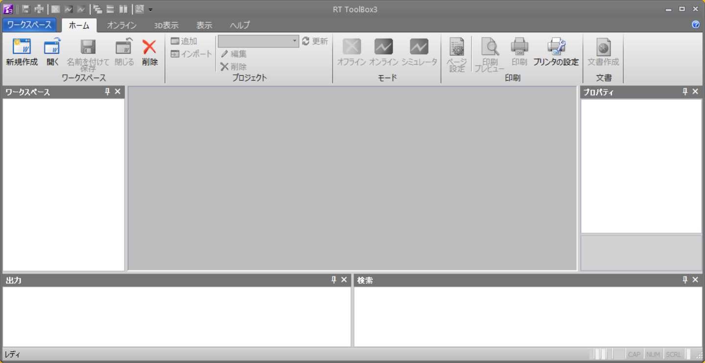
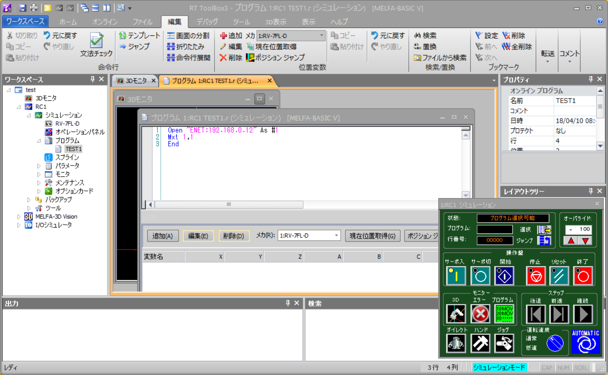
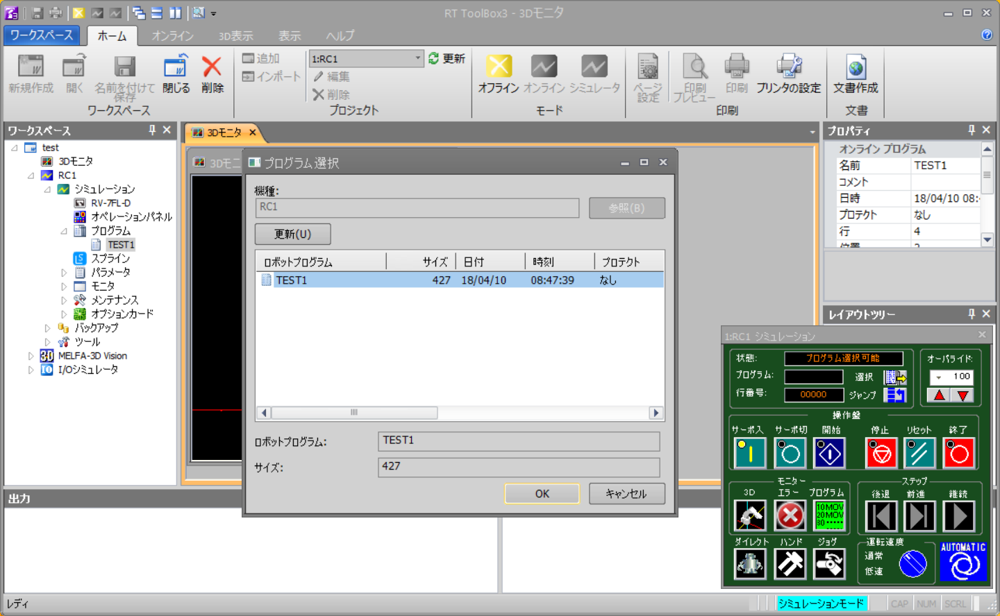

# melfa_robot [](https://travis-ci.com/tork-a/melfa_robot)

This package is to control the MELFA's robot arms using ROS.

# Supported hardware

## Robot controllers

Currently `melfa_driver` is checked with the following MELFA robot
controller.

 CR750-Q 

## Robot arms

Currently `melfa_description` contains the models of following MELFA robots.

 RV4FL

 RV7FL

# Quick start with the loop back node

`melfa_driver/melfa_driver_node` is the controller node, providing
`hardware_interface::RobotHW`. This controller communicates with the
actual robot controller, or the simulator named `RT Toolbox3` on
Windows via Ethernet(TCP/IP).

In case that you don't have both of the controller and simulator, the
package contains the `loop-back(dummy) node` mimicking the robot
controller. It is `melfa_driver/melfa_loopback_node`. This node set
the current joint angle identical to commanded value, and return them
as current state.

When you want to use the loopback node, launch the system as:

```
$ roslaunch melfa_driver melfa_driver.launch loopback:=true 
```

Go to [the section](#check-the-system-works) to check it works.

# Quick start with the RT ToolBox3

If you have `RT ToolBox 3`, the optional software of MELFA robot, you
can use this package with it in the simulation mode.

- [RT ToolBox3](http://www.mitsubishielectric.com/fa/products/rbt/robot/smerit/rt3/index.html)

You have to place your ROS PC and RT ToolBox3 (Windows) PC in the same
network.

## Run RT ToolBox3

Bring up the RT Toolbox3 by double clicking. You would see the screen
like this:



## Create a new project file (need only once)

By pressing `New` button to create a new project file. In the
following wizard screen, push `Next`.


In `2. Robot Model`, choose your robot. In this case, we choose `FD
Series CR750-D` and `RV-7FL-D`. Push `Next` button.


In `3. Communication`, enter the IP address and gateway address of the
Windows PC. Just using `Copy the setting of this machine` will
work. In this example, `192.168.0.23` is the address of the Windows
PC.


## Program for real-time external control

The ROS package expects the controller is running in `Real time
external control mode`, which receive the continuous TCP/IP packet
from external machine. You have to create a program file in the
Program folder in the Workspace.

```
Open "ENET:192.168.0.12" As #1
Mxt 1,1
End
```

In this example, `192.168.0.12` is the IP address of ROS PC. Make sure
it is correct, or the controller cannot receive the packet.



## Switch to the simulation mode

Push `Simulation` button under `Home` tab to switch into the
simulation mode.  You would see your robot model and the controller
panel on the screen.


## Run the program

Push the `Select` button on the right side of `Program:` to select the
program file name which we formally created.



Push the `Run` button on the controller panel.

## Start ROS Controller

Now bring up the ROS controller node with the launch file. `robot_ip`
parameter should be the address of the PC on which the simulator is
running.

```
$ roslaunch melfa_driver melfa_driver.launch \
                 robot_ip:=192.168.0.23 --screen
```

Go to [the section](#check-the-system-works) to check it works.

# Quick start with actual robot controller

The actual robot should work as same as the simulator... but **BE
CAREFUL!!** The robot will move out of your intention. It may collide
with the environment or human beings. Please make sure you can do
experiments safely with your robot.

You have to place your ROS PC and the controller in the same network.

## Program for real time external control

You need the program for real time external control as same as in the
simulator. Create the following program with the pendant (or just
transfer the file from RT Toolbox3).

```
Ovrd 10
Open "ENET:192.168.0.12" As #1
Mxt 1,1
End
```

`Ovrd 10` is limiting the joint velocity for safety. In this example,
`192.168.0.12` is the IP address of ROS PC. Make sure it is correct,
or the controller cannot receive the packet.

Check the IP address of the controller to use it afterwards.

## Run the program

Run the program with the pendant. It will be same as usual usage.

## Start ROS Controller

Now bring up the ROS controller node with the launch file. `robot_ip`
parameter should be the address of the robot controller.

```
$ roslaunch melfa_driver melfa_driver.launch \
                 robot_ip:=192.168.0.23 --screen
```

Go to [the section](#check-the-system-works) to check it works.

# Check the system works 

Once the system is brought up, the way to command the robot is same in
the either way.

If you don't have the view of the robot model in Rviz and you want it,
launch rviz as:

```
$ roslaunch melfa_description rviz.launch use_gui:=false
```

## With rqt plugin

You can use rqt plug-in `JointTrajctoryController` to control the
robot joint angle using slider GUI.

```
$ rqt -s rqt_joint_trajectory_controller/JointTrajectoryController
```

 rqt_joint_trajectory_controller

## MoveIt!

You can try MoveIt! Rviz plug-in.

```
$ roslaunch rv7fl_moveit_config moveit_planning_execution.launch 
```

Currently there are moveit_config packages for the following robot.

 RV4FL

 RV7FL

# License

- [YOODS Inc.](https://www.yoods.co.jp/) holds the copyright of all
  mesh files in ``melfa_description/mesh`` directory which are
  licensed under a Creative Commons Attribution-ShareAlike 4.0
  International License.
- These MoveIt! configuration packages are licensed under BSD License,
  which are basically auto generated by MoveIt! setup assistant
  package.
    - ``rv4fl_moveit_config``
    - ``rv7fl_moveit_config``
- Other parts are licensed under Apache License 2.0.
